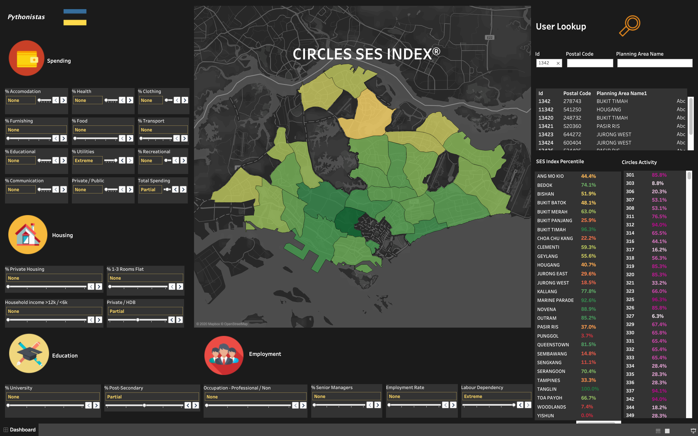
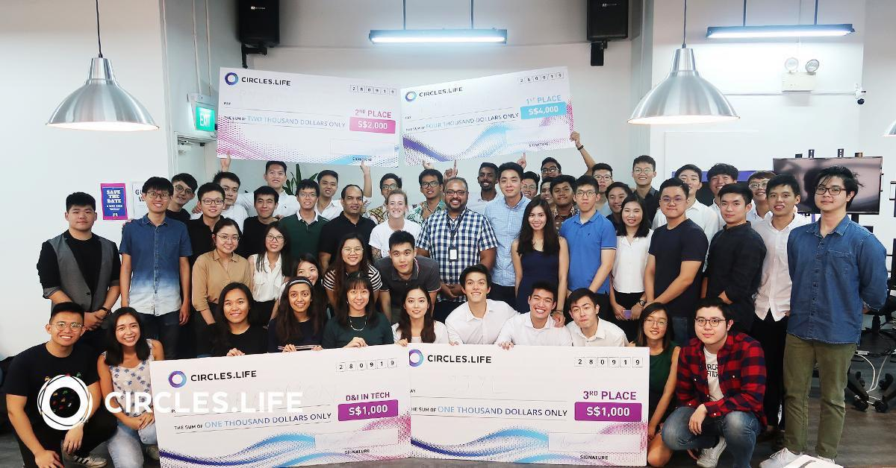
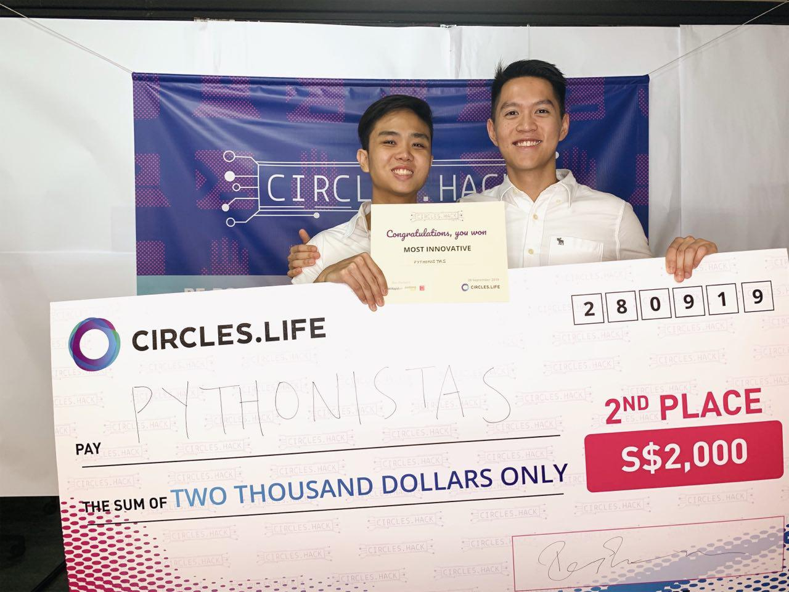

# Circles Hack 2019 (Pythonistas) - Socioeconomic Status by Planning Areas in Singapore.

## Description

Fully functional Tableau dashboard that showcases the socioeconomic status by planning areas in Singapore.

https://public.tableau.com/profile/ernest.chng7033#!/vizhome/Pythonistas_Challenge/Dashboard

## Details

Won Overall Second Prize, and Most Innovative Prize in Circles Hack 2019. More information can be found here:
https://www.comp.nus.edu.sg/news/2019-circles-hack/

